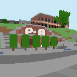
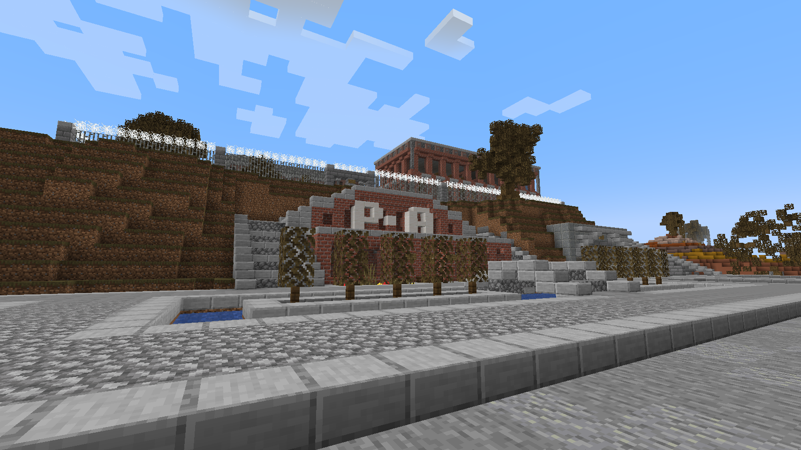
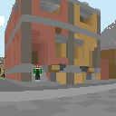
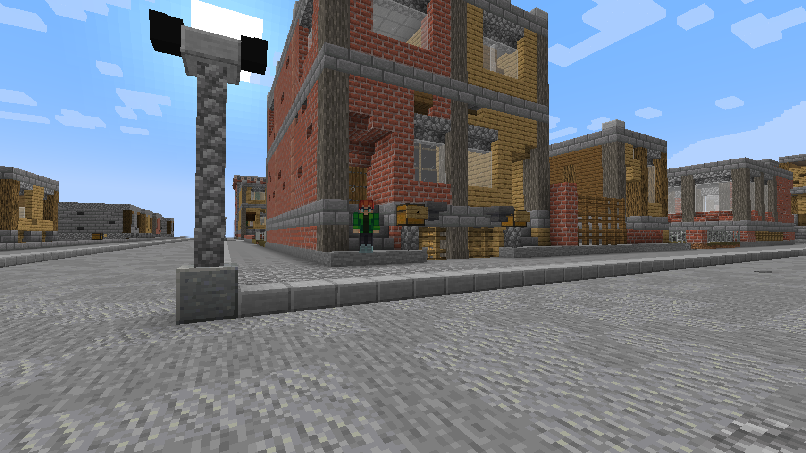

# ImageryAPI
A toolkit for taking pictures and videos in Minecraft.
This library mainly consists of an image capture utility
which will return images when given a location (and sometimes other options).
It looks something like this (left is generated by ImageryAPI, right is a normal Minecraft screenshot):

 

It also supports basic rendering of players.
That would look something like this:

 
 

It works by raytracing pixels of the picture and transforming every block into a color.
It also applies certain filters to the color depending on light level,
or translucent blocks in front of it (e.g. stained glass).

### Video frame capture
This library also has a video frame capture utility.
The goal of this utility is to render a frame very quickly
(or at least fast enough that it can be somewhat useful to creating a 5fps video :P).
This utility is way faster than an image capture,
but compromises quite a lot on looks and accuracy.

**Video frame capture is a very experimental feature.**
Any ideas or PRs that will improve it are greatly appreciated.

## Getting started
The library is a separate plugin which you install in your server
in order to access it inside your own plugin.

Just install a release version of the library as a plugin,
and you're most likely ready to start development.

### Developer guide
Please refer to [this readme](./src/main/java/dev/jensderuiter/minecraft_imagery/image/README.md)
for the developer guide.

### Permissions
Every admin permission requires the `imageryapi.admin` permission.

### Configuration (config.yml)
You can use the config.yml file to customize the color of each block.
Some servers may like a more vibrant color palette, or something completely different.
It'll look something like this:
```yaml
blocks:
  cobblestone: 127,127,127
  bricks: 150,97,83
  # ...
```

Each entry represents a material with an RGB color code.
Make sure that any changes you make will still follow this format.
You're free to change every block color you like.

To apply changes inside this config, execute `/imageryapi reloadconfig`.
Of course, reloading or restarting also works.

If you mess something up, you can always execute `/imageryapi savedefaults`
to revert your config to the default one (your changes will be forever destroyed).

`/imageryapi generatedefaults` is mostly meant for developers.
It will regenerate every block color entry it has an texture from,
and compute the color for the config (average color).
This will overwrite every color entry the plugin has with a newly computed one.
**Only use this if you're upgrading from an older version of ImageryAPI
and want to update old colors (overwrite them) or add new ones that didn't exist before.**